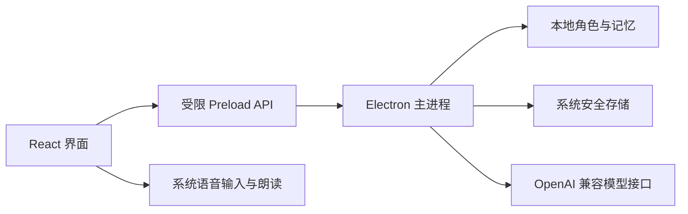

# 架构说明

Hikari 采用“桌面外壳 + 可替换能力接口”的结构。v0.1 保持为单仓库，接口稳定后再考虑拆分软件包。

## 当前结构



渲染进程不拥有 Node.js 权限。文件、密钥和网络模型请求由主进程处理，通过白名单 IPC 方法暴露给界面。

## 目标能力层

| 能力层 | 职责 | 目标扩展点 |
| --- | --- | --- |
| Character | 人格、背景、关系和角色包 | 静态图、Live2D、VRM |
| Model | 对话、规划与结构化输出 | 在线 API、本地模型 |
| Voice | 语音识别、合成与唤醒 | Windows、本地引擎、云服务 |
| Memory | 短期上下文、长期总结与检索 | SQLite、向量索引、同步 |
| Action | 工具调用、权限、确认和日志 | 浏览器、文件、日历、设备 |
| Plugin | 清单、生命周期和兼容性 | 社区能力包与角色包 |

## 角色包草案

未来角色包应是可移植目录或压缩包，并包含声明文件：

```json
{
  "schemaVersion": 1,
  "id": "creator.character-name",
  "name": "Character Name",
  "license": "CC-BY-4.0",
  "avatar": {
    "type": "live2d",
    "entry": "model/model3.json"
  },
  "personality": {
    "prompt": "character.md"
  }
}
```

代码许可证与角色素材许可证必须分开。导入角色时要显示作者、来源、许可证和允许的用途。

## 权限模型

操作能力分为三类：

- `observe`：读取有限信息，例如当前时间。
- `act`：可撤销的普通操作，例如打开应用。
- `dangerous`：不可逆、公开、财务、账号或权限操作，必须逐次确认。

插件只能声明所需权限，最终授权由 Hikari Core 决定。所有实际操作进入本地审计日志，并提供全局紧急停止。

## 数据原则

- 默认本地保存，用户明确开启后才同步。
- API 密钥不进入角色导出包、日志或渲染进程持久化。
- 记忆可查看、修改、删除和完整导出。
- 屏幕感知应支持选择区域、单次授权和明显的录制指示。
